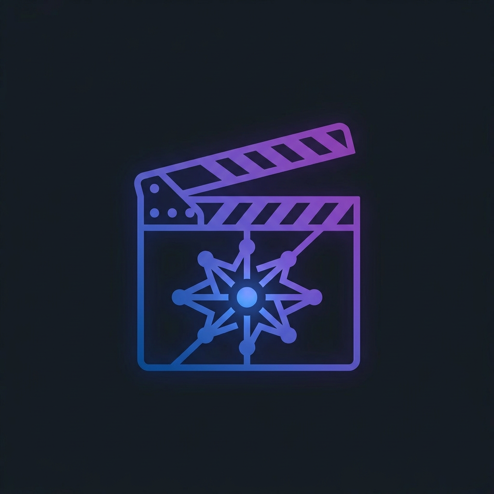

<p align="center">
  
</p>

<h1 align="center">AI Video Forge</h1>

<p align="center">
  <strong>Open-Source Agentic Video Studio — From Concept to MP4</strong>
</p>

<p align="center">
  <a href="https://github.com/KeshavCracks/video-production-buddy/stargazers"></a>
  <a href="LICENSE"></a>
  <a href="#"></a>
  <a href="#"></a>
  <a href="#"></a>
</p>

---

## What It Is

- **Your AI assistant is the producer.** It reads YAML pipelines, discovers tools, and asks for your approval before spending on APIs.
- **Production-first, not generation-first.** Plan, script, review, then render. No surprise bills.
- **Fully open source.** AGPLv3. Self-host locally or run in GitHub Codespaces with zero install.

---

## ⚡ Quick Start

```bash
git clone https://github.com/KeshavCracks/video-production-buddy.git
cd video-production-buddy
python3 -m venv .venv && source .venv/bin/activate
make setup && make demo
```

No API keys required. The demo renders locally with Remotion + FFmpeg + Piper TTS.

**Requirements:** Python 3.10+, Node.js 22+, FFmpeg, Make. Or just open in **GitHub Codespaces** (one-click, zero install).

---

## 🎬 Demos

### MacBook Air Ad
> Prompt: *"Please help me design an ad video for MacBook Air."*

<video src="https://github.com/user-attachments/assets/df481a12-a150-41c6-97fe-24afcbeb85db" width="100%" controls poster="assets/readme/macbook_air.jpg"></video>

### Guided Product Ad
> Full assistant flow: intake → proposal → assets → composition → review → delivery.

<video src="https://github.com/user-attachments/assets/c240b2d1-5c65-41f1-8d71-454ae1f43f51" width="100%" controls poster="assets/readme/zhiying.jpg"></video>

---

## 🛠️ Tech Stack

| Composition | Media Engine | Runtime | Voice | Image | Video |
|-------------|--------------|---------|-------|-------|-------|
| Remotion | FFmpeg | Python 3.10+ | Piper TTS (free) | FLUX | WAN 2.1 |
| HyperFrames | | Node.js 22 | ElevenLabs | DALL-E | Hunyuan |
| | | | Google TTS | Recraft | CogVideo |

11 pipelines · 47 tools · 124 skills · Auto-routed provider switching

---

## 🌐 Website

The showcase site is built into this repo with Next.js. Deploy to Vercel in 30 seconds:

1. Import this repo into [vercel.com](https://vercel.com)
2. Vercel auto-detects Next.js → deploy

Or run locally:
```bash
npm install && npm run build
# Static export → dist/
```

---

## 📜 License

[GNU AGPLv3](LICENSE). Built on the open-source [OpenMontage](https://github.com/calesthio/OpenMontage) project. When building publicly on this code, share your source.

---

<p align="center">
  <a href="https://github.com/KeshavCracks/video-production-buddy">⭐ Star this repo</a> ·
  <a href="HOSTING.md">🚀 Hosting Guide</a> ·
  <a href="LICENSE">📄 License</a>
</p>
